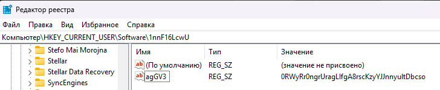
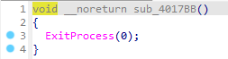
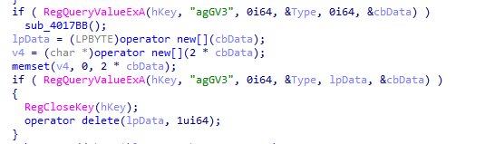
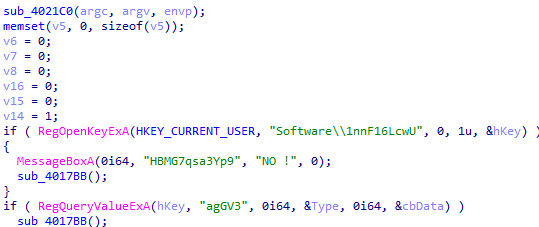
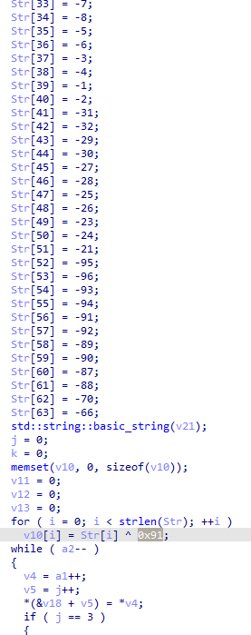
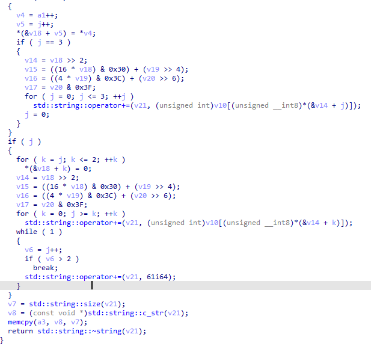
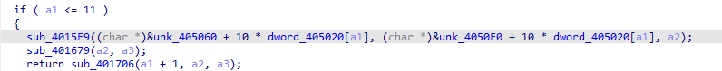
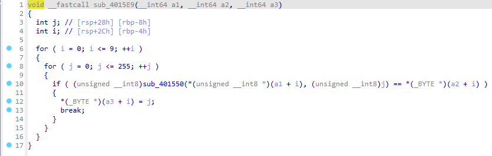
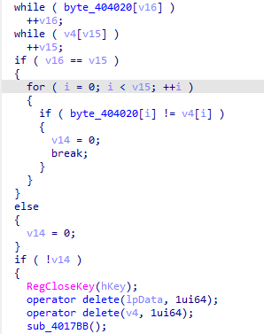
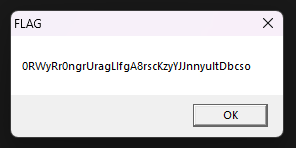

# Crackme #1

## Ответы на вопросы

1. Программа в реестре открывает раздел HKEY_CURRENT_USER
2. Программа в реестре ищет путь Software\1nnF16LcwU
3. Программа пытается открыть строковый параметр agGV3 в 1nnF16LcwU

4. Если программа не найдёт ключ, то программа вернёт ошибку и выполнится переход к подпрограмме sub_4017BB, внутри которой ExitProcess(0), т.е программа просто завершится

5. Для того, чтоб программа вывела FLAG параметр должен содержать строку 0RWyRr0ngrUragLIfgA8rscKzyYJJnnyultDbcso
6. Первый вызов функции RegQueryValueExA делается без буфера, чтобы узнать у системы точный размер флага в реестре. Получив этот размер, программа выделяет под него lpData, чтобы вторым вызовом скопировать саму строку. А v4 выделяется в два раза больше, потому что туда запишут этот же флаг, но переведенный в Base64, из-за чего строка станет длиннее.

## Как работает программа

Программа запускается и сразу пытается перейти в реестр по пути HKEY_CURRENT_USER\Software\1nnF16LcwU. Она ищет там строковый параметр с именем agGV3. Если такой папки или параметра в реестре нет, программа показывает окно с ошибкой "HBMG7qsa3Yp9" и закрывается.

Затем программа дважды вызывает RegQueryValueExA, это уже описано выше в ответах на вопросы

После этого строка из буфера lpData (по сути строка из реестра) отправляется в функцию sub_4017D2. Эта функция сначала расшифровывает спрятанный внутри неё алфавит с помощью операции XOR 0x91 над массивом Str. Они нужны просто как зашифрованная шпаргалка, чтобы программа собрала у себя в памяти стандартную азбуку ABCDEFGHIJKLMNOPQRSTUVWXYZabcdefghijklmnopqrstuvwxyz0123456789+/. 

И вот когда этот алфавит готов, функция берет реальный ввод пользователя из реестра и начинает посимволно пилить его битовыми сдвигами (типа >> 2 и << 4), превращая каждые 3 байта текста в 4 знака Base64. Результат как раз и складывается в тот самый двойной буфер v4.

После этого у нас идёт выполнение строки
 sub_401706(0, (__int64)v5, (__int64)byte_404020);

В этой функции находится ещё одна функция sub_4015E9, которая проходит циклом по двум массивам данных (unk_405060 и unk_4050E0) в секции .rdata и использует массив индексов dword_405020. Программа берет оттуда номер и умножает его на 10

В самой sub_4015E9 ещё вызывается sub_401550 суть которой для каждой пары байтов выполнить операцию XOR.

Результат этой попарной сборки складывается во временный буфер v5. Но прикол в том, что внутри sub_4015E9 генерация ключа устроена через перебор (брутфорс).

Программа запускает цикл, где переменная j по очереди перебирает все числа от 0 до 255. Каждое число вместе с байтом из первой таблицы констант unk_405060 отправляется в функцию sub_401550. Эта функция по сути XOR. Как только этот ксор выдает результат, совпадающий с байтом из второй таблицы unk_4050E0, программа понимает, что нужный байт ключа угадан, и сохраняет это число j в буфер v5. Так за 10 шагов собирается готовый 10-байтовый ключ для текущего раунда.

По этой логике, раз вся функция sub_401706 - это рекурсия, этот подбор ключа запускается на каждом из 12 уровней заново. Как только ключ раунда готов, вызывается функция sub_401679, чтобы наложить его на зашитый в программе правильный ответ byte_404020. Так как этот массив с ответом длинный (56 байт), а ключ короткий (10 байт), программа пускает ключ по кругу с помощью оператора остатка от деления % 10. Первый байт строки ксорится первым байтом ключа, десятый - десятым и т.д. Ксорится всё той же функцией sub_401550. Когда рекурсия полностью закрывает все 12 раундов, массив byte_404020 превращается в чистую Base64-строку.

В самом конце выполнение возвращается в main, где лежат две готовые Base64-строки: буфер v4 (ввод из реестра) и расшифрованный массив byte_404020 (правильный эталон). Сначала программа сверяет их длину короткими циклами while. Если длины разные сразу вылет. Если длины совпали, запускается финальный цикл for, который сравнивает каждую букву. Если хоть один символ отличается, программа сбрасывает флаг валидности, чистит память и закрывается. 

Если же всё совпало идеально, программа выдает окно MessageBoxA с заголовком FLAG.

Чтобы получить флаг, надо выполнить обратное преобразование: взять зашитый в программе 56-байтовый массив byte_404020, пошагово снять с него все 12 слоев шифрования в обратном порядке и перевести финальную Base64-строку в понятный текст. Поскольку операция XOR полностью обратима, алгоритм в точности копирует логику самой программы, но запускает раунды от последнего к первому

[Здесь код для этого](1.py)
